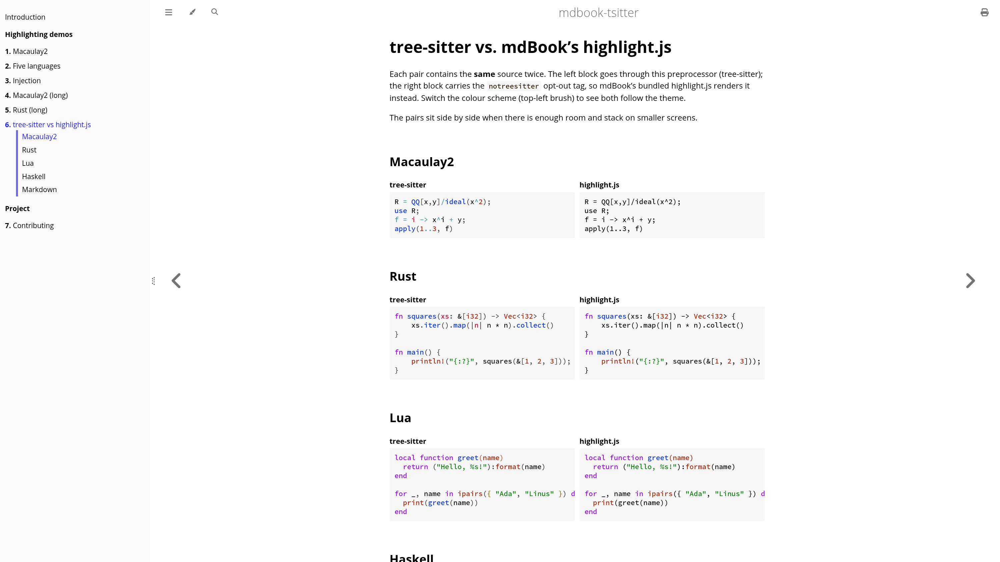

# mdbook-tsitter

> Tree-sitter syntax highlighting for [mdBook](https://rust-lang.github.io/mdBook/) — for any language you can point a grammar at.

<p align="center">
  <a href="https://spectralflux.dev/mdbook-tsitter">
    
  </a>
</p>

<p align="center">
  <a href="https://spectralflux.dev/mdbook-tsitter"><strong>Open the live example book</strong></a>
</p>

`mdbook-tsitter` is an mdBook preprocessor that parses fenced code blocks with
[tree-sitter](https://tree-sitter.github.io/) and renders the resulting captures
as themeable HTML. It is grammar-agnostic: supply a compiled parser and the
grammar's highlight queries, and the same preprocessor can handle anything from
Rust and Lua to a language of your own.

## Features

- **Grammar-agnostic.** Use any tree-sitter grammar that can be built as a
  shared library.
- **Structural highlighting.** Definitions, calls, types, parameters,
  properties, macros, and other syntax can receive distinct styles whenever the
  grammar's queries distinguish them.
- **Embedded languages.** Injection queries can highlight fenced code inside
  Markdown, languages embedded in strings, and other nested syntax.
- **Themeable capture classes.** Captures become predictable `ts-…` CSS
  classes, with a bundled stylesheet that follows mdBook's light, rust, coal,
  navy, and ayu themes.
- **Language aliases and locals queries.** Match several fence names to one
  grammar and opt into scope-aware query behavior where the grammar supports it.
- **Selective processing.** Leave individual blocks to mdBook when you need its
  built-in Rust Playground behavior or other native code-block features.
- **Build-time rendering.** Highlighted HTML is generated with the book; the
  reader does not need a tree-sitter runtime.

The [example book](https://spectralflux.dev/mdbook-tsitter) demonstrates
Macaulay2, Rust, Lua, Haskell, Markdown injections, long source files, and
side-by-side renderer examples. Its complete source lives in
[`examples/languages`](examples/languages).

## Installation

Install the preprocessor from crates.io:

```sh
cargo install mdbook-tsitter
```

The `mdbook-tsitter` binary must be available on `PATH` when `mdbook build`
runs. Each configured language also needs:

1. A compiled tree-sitter parser (`.so`, `.dylib`, or `.dll`).
2. Its `queries/highlights.scm` file.
3. Optionally, `injections.scm` and `locals.scm`.

See [Getting parsers and queries](#getting-parsers-and-queries) for common ways
to obtain them.

## Quick start

Generate the default stylesheet in your book:

```sh
mkdir -p theme
mdbook-tsitter css > theme/treesitter.css
```

Place a parser and its highlight query in your project, then configure
`book.toml`:

```toml
[preprocessor.tsitter]

[preprocessor.tsitter.languages.rust]
library = "parsers/rust.so"
highlights = "queries/rust/highlights.scm"

[output.html]
additional-css = ["theme/treesitter.css"]
```

Paths are relative to the book root. After that, ordinary fenced blocks for the
configured language are highlighted automatically:

````markdown
```rust
fn main() {
    println!("highlighted at build time");
}
```
````

Build the book as usual:

```sh
mdbook build
```

Languages that are not configured, blocks without a language tag, and blocks
that opt out are left untouched for mdBook to handle.

## Configuring languages

Everything lives under `[preprocessor.tsitter]`.

### Preprocessor options

| key      | default | meaning |
| -------- | ------- | ------- |
| `inject` | `true`  | Highlight embedded languages using configured injection queries. Only configured languages are used. Set this to `false` to disable injections globally. |

### Language options

Add one `[preprocessor.tsitter.languages.<name>]` table per grammar:

| key          | required | meaning |
| ------------ | -------- | ------- |
| `library`    | yes      | Path to the compiled parser shared library. |
| `highlights` | yes      | Path to the grammar's highlights query. |
| `symbol`     | no       | Parser constructor symbol; defaults to `tree_sitter_<name>` with `-` changed to `_`. |
| `injections` | no       | Path to an injections query for embedded languages. |
| `locals`     | no       | Path to a locals query for scope-aware highlighting. |
| `aliases`    | no       | Additional code-fence names handled by this grammar; defaults to the table key. |

A fuller Markdown configuration might look like this:

```toml
[preprocessor.tsitter.languages.markdown]
library = "parsers/markdown.so"
highlights = "queries/markdown/highlights.scm"
injections = "queries/markdown/injections.scm"
aliases = ["md", "markdown"]
```

Injection queries can select another configured grammar using standard
`@injection.language` and `@injection.content` captures. All grammars share the
same capture-class table during a build, so embedded and host languages use the
same theme consistently.

### Leaving a block to mdBook

Processing a block replaces its Markdown with highlighted HTML. Add the
`notreesitter` annotation when a block should retain mdBook's own handling,
including Rust Playground buttons, hidden lines, and `ignore` or `no_run`
annotations:

````markdown
```rust,notreesitter
# fn main() {
let runnable = "mdBook keeps control of this block";
# }
```
````

## Getting parsers and queries

Most grammars live in a `tree-sitter-<language>` repository. With the
[tree-sitter CLI](https://github.com/tree-sitter/tree-sitter), a typical parser
build looks like:

```sh
git clone https://github.com/<owner>/tree-sitter-nix
cd tree-sitter-nix
tree-sitter build --output libtree-sitter-nix.so
```

Use `.dylib` on macOS or `.dll` on Windows, and point `library` at the exact
output path. The extension is never assumed.

The highlight query is usually the grammar's `queries/highlights.scm`. An
existing [nvim-treesitter](https://github.com/nvim-treesitter/nvim-treesitter)
installation is another convenient source of compiled parsers and queries.

The setup script in [`examples/languages/setup.sh`](examples/languages/setup.sh)
shows one way to stage several parsers and their queries for a complete book.

## Theming

The generated stylesheet covers standard tree-sitter and nvim-treesitter
capture names and adapts to mdBook's built-in colour schemes. Edit it directly
or add a later stylesheet with your overrides.

Each capture gets the `ts-` prefix, dots become hyphens, and every prefix is
emitted so broad rules can cascade into more specific ones:

| capture            | generated classes                    |
| ------------------ | ------------------------------------ |
| `keyword`          | `ts-keyword`                         |
| `keyword.operator` | `ts-keyword ts-keyword-operator`     |
| `string.regexp`    | `ts-string ts-string-regexp`         |

For example:

```css
.ts-comment {
  font-style: italic;
}

code.language-rust .ts-function-macro {
  color: var(--ts-purple);
}
```

There is no fixed capture list in the preprocessor. Capture names come directly
from each grammar's queries; names beginning with `_` are treated as internal
and left unstyled.

## How it works

mdBook passes every chapter to the preprocessor as Markdown. `mdbook-tsitter`
uses the same Markdown parser as mdBook
([pulldown-cmark](https://docs.rs/pulldown-cmark)), locates top-level fenced code
blocks for configured languages, and sends their source through
tree-sitter-highlight.

The highlighted events become semantic CSS classes and are spliced back into
the chapter as ready-made HTML:

```html
<pre class="treesitter"><code class="no-highlight language-rust">…spans…</code></pre>
```

The original language class remains available for per-language styles, while
`no-highlight` marks the HTML as already processed.

## Development

Run the Rust test suite:

```sh
cargo test
```

Build the multi-language example book:

```sh
./examples/languages/setup.sh
mdbook build examples/languages
```

The parsers and queries used by the deployed example are committed so the
hosted build is reproducible. The setup script is useful when refreshing those
assets from local grammar installations.

## License

Licensed under either of [MIT](LICENSE-MIT) or [Apache-2.0](LICENSE-APACHE) at
your option.
